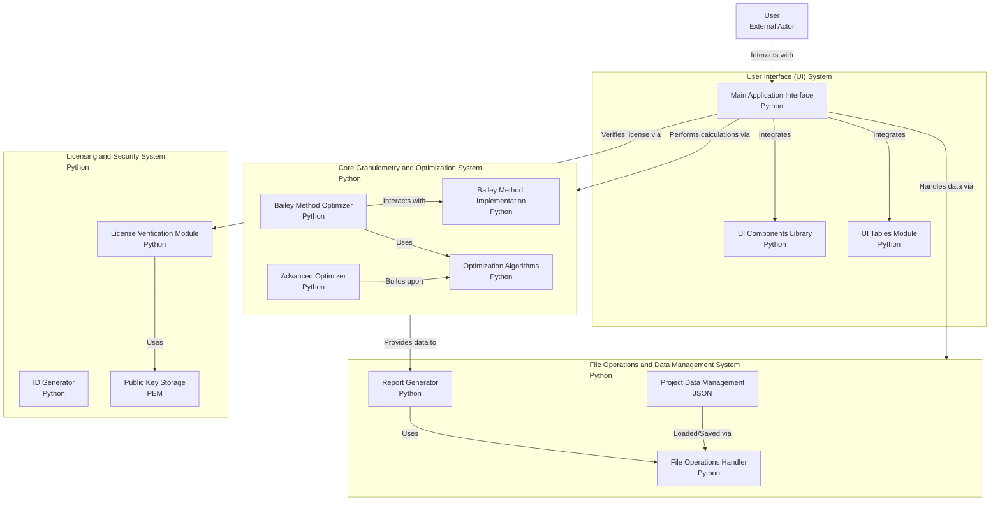

# Granulometría_45

**Granulometría_45** es una aplicación de ciencia de datos con python, para escritorio y diseñada para realizar un análisis granulométrico de mezclas asfálticas bajo la especificación **AASHTO M323** utilizando la gráfica de potencia 0.45 de la **FHWA**. La herramienta está orientada a profesionales y técnicos en ingeniería de pavimentos y tiene como objetivo optimizar el diseño de mezclas asfálticas mediante un análisis interactivo.

Link para descarga: https://github.com/germancruzram/GRANULOMETRIA_45/releases/download/GRANULOMETRIA_45__v2.0/GRANULOMETRIA_45__v2_20.exe

## Características principales

### 🛠️ **Herramientas de Análisis**

- **Análisis Interactivo**: Permite ingresar datos de diseño y visualizar la curva granulométrica al instante.
- **Optimización de Mezclas**: Determina las proporciones óptimas de hasta 5 agregados para cumplir con las especificaciones **SUPERPAVE**.
- **Generación de Reportes**: Exporta informes completos en formato PDF con los datos del proyecto, la tabla granulométrica y la gráfica final.

### 📈 **Visualización de Resultados**

- Visualiza la curva granulométrica junto con las **líneas de máxima densidad** y **bandas de especificación**.
- Muestra las **marcas Bailey** y permite ajustar las proporciones de los agregados en función de los resultados obtenidos.

### 🗂️ **Gestión de Proyectos** (requiere licencia)

- **Guardar y cargar proyectos**: Facilita la organización de diferentes proyectos y su análisis histórico.
- **Configuración personalizable**: Permite ajustar las especificaciones de granulometría y optimización.

## 📊 **Gráfico de Estructura de la Aplicación**

## 🤝**Contribuciones y recomendaciones**

Son bienvenidas. En el perfil se encuentra mi contacto.

## 👨‍💻**Autor**

German Ahmed Cruz Ramírez  
[LinkedIn](https://www.linkedin.com/in/german-cruz-ram-in24/)
